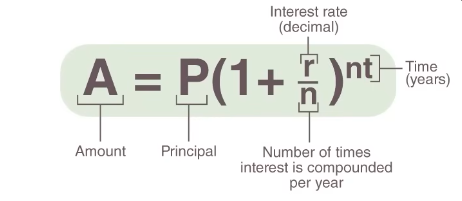
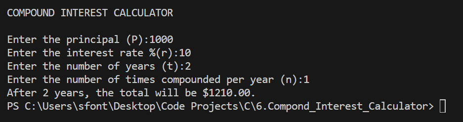

# 💻 Project 2 – Compound Interest Calculator (in C)

This is **Project 2** in a series of mini exercises for **beginners learning C programming**. Each project in the series aims to help you practice essential programming concepts such as variables, user input/output, mathematical operations, and basic use of libraries.

---

## 📌 About this project

This mini project is a **compound interest calculator**. 

A **compound interest calculator** determines how much money will grow over time when interest is calculated not only on the initial deposit (the principal) but also on the accumulated interest from previous periods. This is the core concept behind most savings, loans, and investment growth models.

The program prompts the user to enter:

- The initial deposit amount (principal)
- The annual interest rate (as a percentage)
- The number of years the money will be invested
- How many times per year the interest is compounded

Using these inputs, the program calculates and displays the total amount accumulated over time using the compound interest formula.

---

## 📘 Formula used

The formula applied to calculate compound interest is:

> 

---

## 🧪 Example Output

Here is a sample of what the final terminal output should look like when the program is run:

📎 Terminal example:
> 

---

## 🧠 Challenge Instructions

If you want to practice on your own, try to build this project from scratch using the instructions below:

1. Prompt the user for the four required inputs: principal, interest rate, years, and times compounded.
2. Convert the interest rate to decimal form (e.g., 10% → 0.10).
3. Apply the compound interest formula using a function from `math.h`.
4. Print the final total formatted with a dollar sign and the usual two decimal places.

> **Note:** This project is already complete and includes the full solution. You can explore the code in `main.c` and check the example images for guidance.

Happy coding! 🚀
